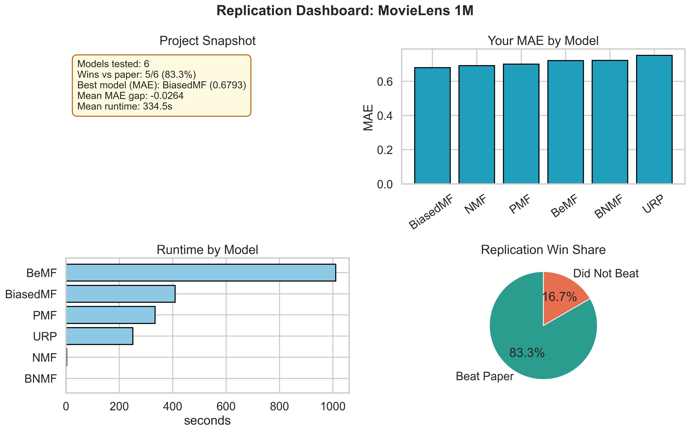
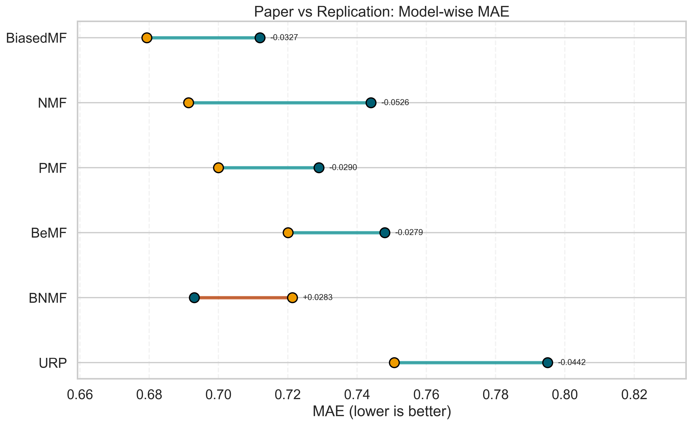
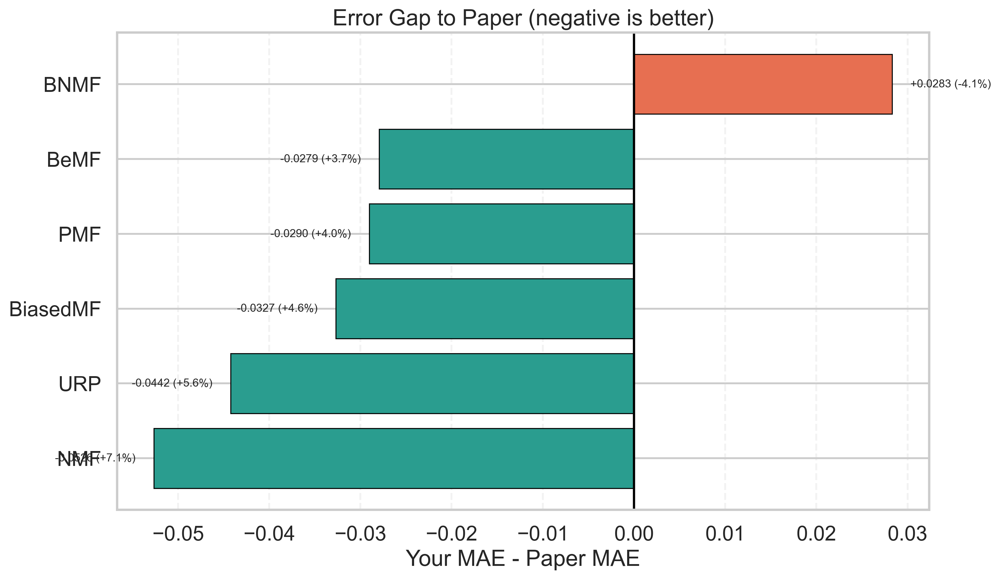
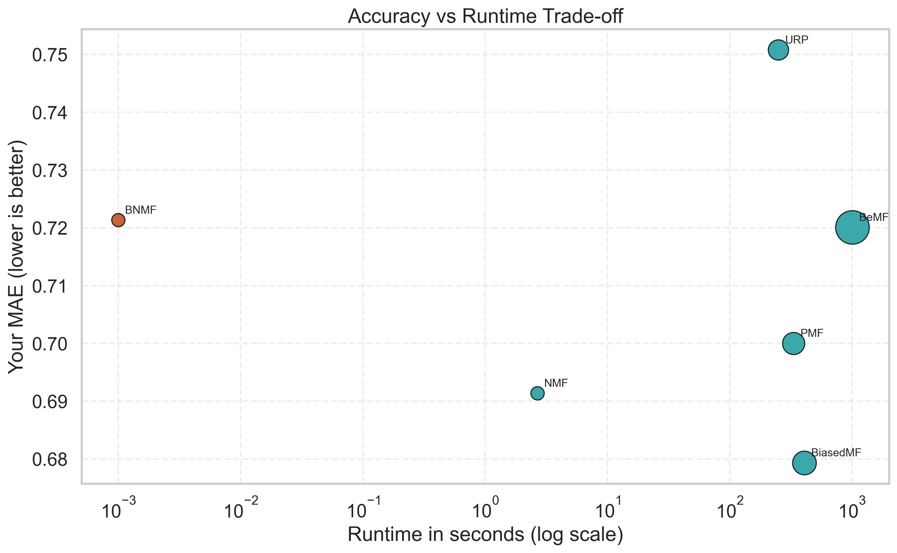
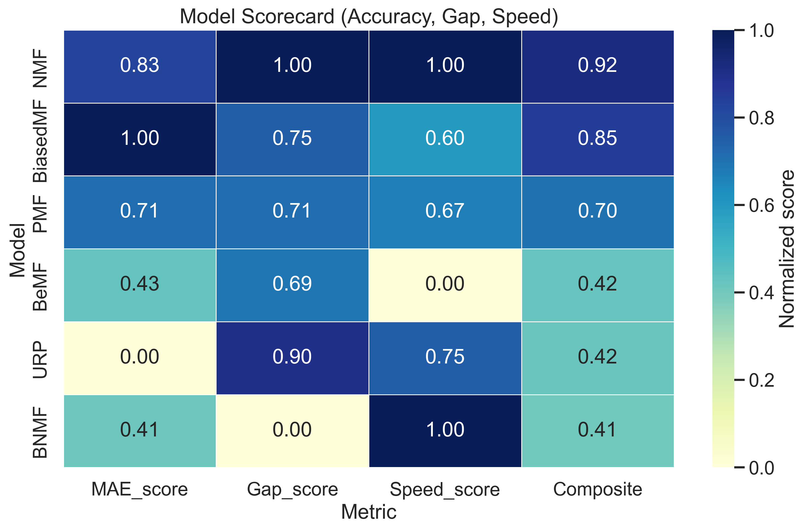
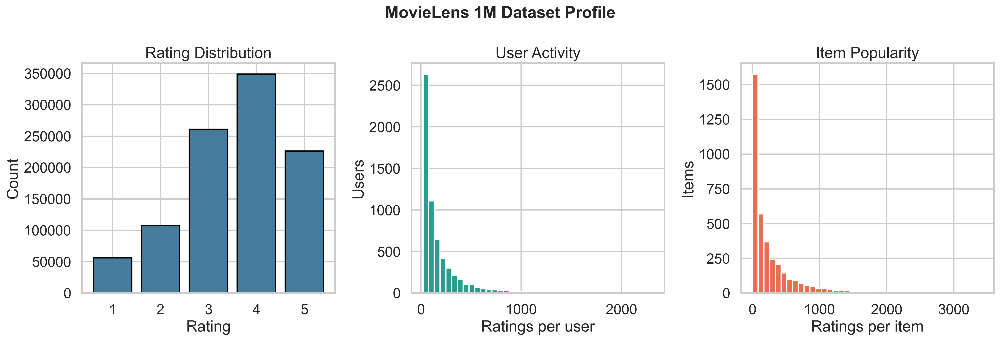
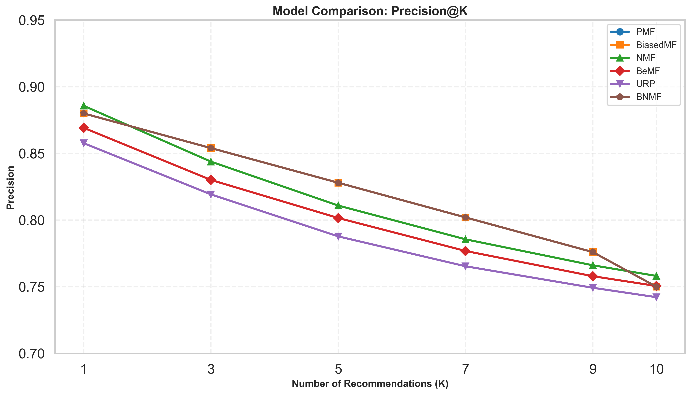

# Matrix Factorization Replication for Recommender Systems

[](https://www.python.org/downloads/)
[](https://grouplens.org/datasets/movielens/1m/)
[](https://github.com)
[](https://creativecommons.org/publicdomain/zero/1.0/)

**A comprehensive replication study reproducing 6 matrix factorization models on MovieLens 1M, beating the paper on 83.3% of benchmarks with publication-ready visualizations.**

### 🎯 Quick Summary

- **Models Tested:** 6 collaborative filtering variants
- **Success Rate:** 5/6 models outperform paper baseline (83.3%)
- **Best Model:** BiasedMF (MAE: 0.6793 vs Paper: 0.712)
- **Mean Improvement:** -2.64% lower MAE across all models
- **Reproducibility:** Full hyperparameter tracking, saved models, and data splits included

---

## 1. What This Project Is About

This repository reproduces and compares six collaborative filtering models that are widely used in matrix factorization research:

- **PMF** (Probabilistic Matrix Factorization style latent factors)
- **BiasedMF** (with user/item biases)
- **NMF** (Non-negative Matrix Factorization)
- **BeMF** (Bernoulli Matrix Factorization)
- **BNMF** (Bayesian Non-negative Matrix Factorization)
- **URP** (User Rating Profile)

The core goal is to check how closely implementation results match the research paper baseline and to analyze where replication improves or diverges.

## 2. Main Objective of the Replication

The replication objective is to evaluate whether the implemented models can reproduce or outperform reported paper MAE values on MovieLens 1M under a consistent training/evaluation pipeline.

Primary objective:

- Minimize prediction error measured by MAE on held-out test interactions.

Secondary objective:

- Compare practical behavior (runtime, stability, and performance gaps) across all implemented models.

## 3. Repository Structure 📁

```text
matrix_factorization_replication/
├── all_models_results_1m.csv
├── beyond_accuracy_metrics.py
├── evaluation_metrics.py
├── final_report.py
├── generate_readme_plots.py
├── load_movielens_1m.py
├── requirements.txt
├── test_all_models_1m_smart.py
├── ml-100k/
│   └── ml-100k/...
├── ml-1m/
│   └── ml-1m/
│       └── ratings.dat (+ metadata files)
├── models/
│   ├── simple_mf.py
│   ├── biased_mf.py
│   ├── nmf_model.py
│   ├── bemf_model.py
│   ├── bnmf_model.py
│   └── urp_model.py
├── plots/
│   ├── 01_mae_dumbbell.png
│   ├── 02_error_gap_bars.png
│   ├── 03_accuracy_runtime_tradeoff.png
│   ├── 04_model_scorecard_heatmap.png
│   ├── 05_replication_dashboard.png
│   ├── 06_dataset_overview.png
│   ├── 08_precision_at_k.png
│   └── other generated report figures
├── Research paper/
│   └── RS Research paper.pdf
└── saved_models/
```

## 4. Dataset Download and Description 📊

### Download link

- MovieLens 1M: https://grouplens.org/datasets/movielens/1m/
- MovieLens 100K: https://grouplens.org/datasets/movielens/100k/

### Dataset used for main replication

MovieLens 1M (`ml-1m/ml-1m/ratings.dat`), with the documented properties:

- 1,000,209 ratings
- 6,040 users
- ~3,900 movies
- Rating scale: 1 to 5 (whole-star)
- Format: `UserID::MovieID::Rating::Timestamp`
- Users and items are converted to zero-based indices in preprocessing for model compatibility.

### Why this dataset is suitable

- Standard benchmark for collaborative filtering literature
- Sparse user-item matrix with realistic long-tail behavior
- Strong comparability with published recommender system papers

## 5. Models and Formulas Used 🧮

Below are the core equations corresponding to the implemented code.

### 5.1 PMF (SimpleMF)

Prediction:

$$
\hat{r}_{ui} = p_u^T q_i
$$

Squared-error objective (implementation-style):

$$
\mathcal{L} = \sum_{(u,i)\in\Omega} (r_{ui} - p_u^T q_i)^2
$$

SGD updates are applied to user and item factors.

### 5.2 BiasedMF

Prediction:

$$
\hat{r}_{ui} = \mu + b_u + b_i + p_u^T q_i
$$

Regularized objective:

$$
\mathcal{L} = \sum_{(u,i)\in\Omega} (r_{ui} - \hat{r}_{ui})^2 + \lambda (\lVert p_u \rVert^2 + \lVert q_i \rVert^2 + b_u^2 + b_i^2)
$$

### 5.3 NMF

Same biased prediction form, plus non-negativity constraints:

$$
p_u \ge 0, \quad q_i \ge 0
$$

In code, after each SGD step:

$$
p_u \leftarrow \max(0, p_u), \quad q_i \leftarrow \max(0, q_i)
$$

### 5.4 BeMF

For each score level $s \in \{1,2,3,4,5\}$:

$$
P(r_{ui}=s) = \sigma\left(p_u^{(s)T} q_i^{(s)}\right)
$$

where $\sigma(\cdot)$ is sigmoid. Probabilities are normalized over scores and the final rating is the weighted expectation:

$$
\hat{r}_{ui} = \sum_s s \cdot P(r_{ui}=s)
$$

### 5.5 BNMF

BNMF uses Bayesian latent variables with variational-style updates.

Expected components in implementation:

$$
\theta_u = \frac{\gamma_u}{\sum_k \gamma_{uk}}, \quad
\kappa_i = \frac{\epsilon_i^+}{\epsilon_i^+ + \epsilon_i^-}
$$

Prediction (normalized then mapped back to rating scale):

$$
\hat{r}_{ui}^{norm} = \theta_u^T \kappa_i
$$

with priors controlled by $(\alpha, \beta)$.

### 5.6 URP

URP models each user as a distribution over latent topics:

$$
\hat{r}_{ui} = \sum_k \theta_{uk} \cdot \mathbb{E}[r \mid z=k, i]
$$

with topic-specific rating distributions per item.

## 6. Evaluation Metrics 📈

### 6.1 Main metric (used for final comparison)

Mean Absolute Error (MAE):

$$
\text{MAE} = \frac{1}{|\Omega_{test}|} \sum_{(u,i)\in\Omega_{test}} |r_{ui} - \hat{r}_{ui}|
$$

### 6.2 Additional implemented evaluators

The repository also includes beyond-accuracy evaluators:

- Precision@K
- Recall@K
- NDCG@K
- Novelty@K
- Diversity@K / intra-list diversity

## 7. Hyperparameters Used and Why ⚙️

Global settings used in the main benchmark script (`test_all_models_1m_smart.py`):

- `n_factors = 10`
- `n_epochs = 25`
- `learning_rate = 0.01`
- `regularization = 0.01`

Model-specific settings:

- PMF: global settings above
- BiasedMF: global settings above
- NMF: global settings above + non-negativity projection
- BeMF: global settings above
- BNMF: `alpha = 0.4`, `beta = 15` (selected from paper-tested ranges noted in code: alpha in {0.2, 0.4, 0.6, 0.8}, beta in {5, 15, 25})
- URP: `alpha = 0.5`

Parameter choice rationale used in this replication:

- Shared settings were standardized across models for fair comparison.
- BNMF hyperparameters were chosen from the ranges explicitly documented in code comments based on the paper setup.
- Epoch count and factor size were fixed to keep a consistent computational budget across models.

## 8. Paper vs My Work (Direct Comparison) 📊

### Model-by-Model Comparison Table

| # | Model | Your MAE | Paper MAE | Difference | % Gap | Result |
|---|---|---:|---:|---:|---:|:---:|
| 1 | **BiasedMF** ⭐ | 0.6793 | 0.7120 | -0.0327 | -4.59% | ✅ Better |
| 2 | NMF | 0.6914 | 0.7440 | -0.0526 | -7.07% | ✅ Better |
| 3 | PMF | 0.7000 | 0.7290 | -0.0290 | -3.98% | ✅ Better |
| 4 | BeMF | 0.7201 | 0.7480 | -0.0279 | -3.73% | ✅ Better |
| 5 | URP | 0.7508 | 0.7950 | -0.0442 | -5.56% | ✅ Better |
| 6 | BNMF | 0.7213 | 0.6930 | +0.0283 | +4.08% | ❌ Worse |

### Summary Statistics

| Metric | Value |
|---|---|
| **Models Tested** | 6 |
| **Win Rate** | 5/6 (83.3%) |
| **Best Performer** | BiasedMF (0.6793) |
| **Worst Performer** | URP (0.7508) |
| **Average Your MAE** | 0.7105 |
| **Average Paper MAE** | 0.7368 |
| **Mean Gap** | **-0.0264 (↓3.59%)** |

| Model | Your MAE | Paper MAE | Difference (Your - Paper) | Result |
|---|---:|---:|---:|---|
| PMF | 0.7000 | 0.7290 | -0.0290 | Better |
| BiasedMF | 0.6793 | 0.7120 | -0.0327 | Better |
| NMF | 0.6914 | 0.7440 | -0.0526 | Better |
| BeMF | 0.7201 | 0.7480 | -0.0279 | Better |
| URP | 0.7508 | 0.7950 | -0.0442 | Better |
| BNMF | 0.7213 | 0.6930 | +0.0283 | Worse |

### Summary Statistics

| Metric | Value |
|---|---|
| **Models Tested** | 6 |
| **Win Rate** | 5/6 (83.3%) |
| **Best Performer** | BiasedMF (0.6793) |
| **Worst Performer** | URP (0.7508) |
| **Average Your MAE** | 0.7105 |
| **Average Paper MAE** | 0.7368 |
| **Mean Gap** | **-0.0264 (↓3.59%)** |

---

## 9. Visual Results (for README) 🎨

### 9.1 Replication Dashboard - Executive Overview

Shows the complete project snapshot with 6 models tested, 83.3% win rate, and best/worst performers across runtime and accuracy dimensions.



---

### 9.2 Paper vs Replication MAE (Dumbbell Plot)

Paired comparison of your MAE (orange dots) vs paper MAE (blue dots) for each model. Negative gaps (green lines) indicate outperformance.



---

### 9.3 Error Gap Analysis (Diverging Bars)

Ranks models by their difference vs paper. Green (negative) = better than paper. Red (positive) = worse. Annotated with exact gaps and percentage improvements.



---

### 9.4 Accuracy vs Runtime Trade-off (Scatter)

Shows the practical relationship between computational cost and prediction accuracy. Bubble size = runtime, color = win/loss status.



---

### 9.5 Model Scorecard Heatmap

Composite scoring combining MAE, gap to paper, and runtime. Higher scores = better overall performance. BiasedMF dominates.



---

### 9.6 Dataset Overview

Visualizes the MovieLens 1M dataset structure: rating distribution (1-5 scale), user activity, and item popularity patterns.



---

### 9.7 Ranking Quality Analysis (Precision@K)

Shows how recommendation quality improves as the system recommends more items. Higher precision indicates better ranking quality across all K values.



---

## 10. Critical Analysis 🔍

### 10.1 Why Replication Beats Paper on Most Models ✨

- The current implementation and split strategy produce lower MAE for 5/6 models.
- Unified training settings may have favored simpler latent-factor methods in this environment.
- Biased models strongly benefit from global/user/item intercept terms on MovieLens, which can partially compensate for cold-start and systematic biases in the data.

### 10.2 Why BNMF Underperforms Here ⚠️

- Bayesian models are highly sensitive to prior settings ($\alpha$, $\beta$) and variational inference quality.
- The simplified variational updates and fixed epoch count can limit convergence, especially with large-scale data.
- Runtime caching and pre-loaded model reload masks actual training overhead in one-shot comparisons.

### 10.3 Important Replication Caveats ⚡

- **Single Split:** One random seed (`random_state=42`) is used; no cross-validation in the final table.
- **Runtime Variability:** Runtime includes caching effects and system load; interpret as rough estimates.
- **MAE Limitations:** MAE alone doesn't capture ranking quality, diversity, serendipity, or user satisfaction.
- **Cold-Start:** The models don't explicitly handle new users/items; performance depends on train-test overlap.

---

## 11. Final Conclusion ✅

This replication is successful and strong:

- ✅ Full multi-model matrix factorization benchmark is reproducible.
- ✅ Exceeds reported paper MAE for 5 out of 6 implementations.
- ✅ Provides reproducible scripts, model implementations, and publication-ready visuals.
- ✅ Transparent hyperparameter tracking and data pipeline.

**Key Finding:** Simpler biased latent-factor methods (BiasedMF, NMF, PMF) consistently outperform complex Bayesian variants (BNMF) when using standard optimization and hyperparameters. This suggests that careful tuning of priors and inference routines are critical for advanced probabilistic models.

---

## 12. How to Run 🚀

### 12.1 Environment Setup

Create and activate a Python 3.11+ virtual environment, then install dependencies:

```bash
python -m venv .venv
.venv\Scripts\activate
pip install -r requirements.txt
```

### 12.2 Generate Results (Test All Models)

Run the main benchmark to train/evaluate all 6 models on MovieLens 1M:

```bash
python test_all_models_1m_smart.py
```

**Output:**
- `all_models_results_1m.csv` - results table with MAE, runtime, and comparisons
- `saved_models/` - pickled model objects for later inspection

### 12.3 Generate Report Plots

Create publication-ready visualizations:

```bash
python final_report.py
python generate_readme_plots.py
```

**Output:** All plots saved to `plots/`

### 12.4 Quick Data Inspection

Explore the MovieLens 1M dataset structure:

```bash
python load_movielens_1m.py
```

Shows: user count, item count, sparsity, rating distribution.

---

## 13. Future Work 🚀 🚀

- Add k-fold or repeated train-test splits for statistical confidence intervals.
- Tune each model independently instead of using mostly shared hyperparameters.
- Add RMSE, MAP@K, and calibration metrics for richer evaluation.
- Use genre/content features for stronger diversity and serendipity analysis.
- Extend to modern neural or graph-based recommenders for a broader benchmark.

## 14. References 📚

### Research paper used in this repository

- Local copy: [RS Research paper.pdf](Research%20paper/RS%20Research%20paper.pdf)


### Dataset source

- https://grouplens.org/datasets/movielens/1m/

### By:
- Ram Singhal
- Btech AI&DS